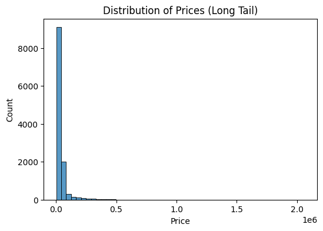
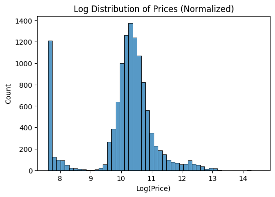
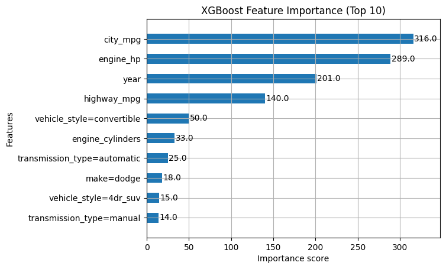
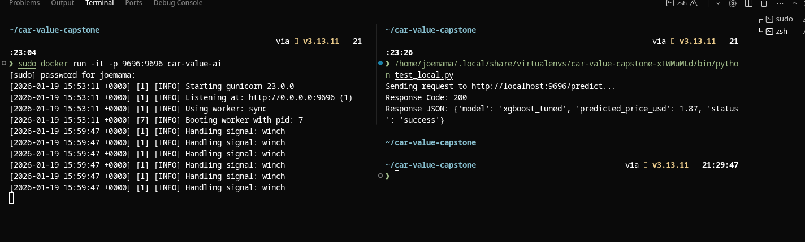
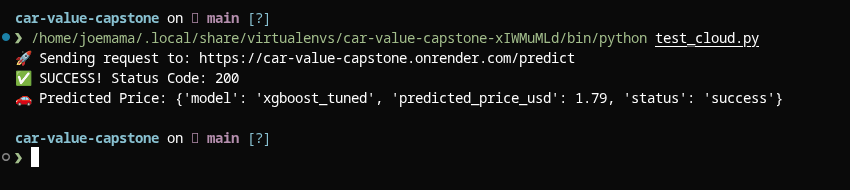

# 🚗 CarValue AI: Used Car Price Prediction


**CarValue AI** is an end-to-end Machine Learning service designed to predict the fair market value (MSRP) of used vehicles. By analyzing technical specifications—such as engine power, MPG, and age—the model provides an objective baseline for pricing, helping sellers set fair prices and buyers avoid overpaying.

**Live Service URL:** `https://car-value-capstone.onrender.com/predict`

---

## 1. Problem Description
The used car market is notoriously opaque. Prices are often driven by subjective factors rather than objective metrics.
* **The Goal:** Build a model that predicts vehicle MSRP with low error (RMSE) based on 11,000+ scraped vehicle records.
* **The Utility:** A deployed API that accepts a JSON profile of a car and returns a predicted price in USD instantly.

---

## 2. Exploratory Data Analysis (EDA)

We performed extensive analysis (see `notebook.ipynb`) to identify the key drivers of price.

### Target Variable Analysis
The raw price distribution was heavily right-skewed (long tail), which is typical for financial data (luxury cars skew the mean).
* **Action:** We applied a `log1p` transformation to normalize the target variable, significantly improving model convergence.

| Raw Price Distribution (Skewed) | Log Price Distribution (Normalized) |
| :---: | :---: |
|  |  |

### Feature Importance & Insights
Using Mutual Information and Correlation matrices, we identified the strongest predictors.

* **Engine HP:** The single strongest predictor of price. High performance commands a premium.
* **MPG:** Interestingly, *lower* MPG often correlates with *higher* price (due to sports/luxury cars having powerful, thirsty engines).
* **Age:** Newer cars (higher Year) exponentially increase in value.



---

## 3. Model Training & Selection

We trained three distinct model architectures and evaluated them using **RMSE** (Root Mean Squared Error) on a validation set.

| Model | RMSE Score | Notes |
| :--- | :--- | :--- |
| **Ridge Regression** | 0.2169 | Baseline linear model. Struggled with non-linear features. |
| **Random Forest** | 0.1636 | Strong performance, but large model size and slower inference. |
| **XGBoost (Tuned)** | **0.1294** | **Champion Model.** Best balance of speed and accuracy. |

### Hyperparameter Tuning
We used specific parameters to optimize the XGBoost regressor, focusing on preventing overfitting while capturing complex patterns.

**Final Parameters:**
```python
xgb_params = {
    'eta': 0.3,              # Learning rate
    'max_depth': 6,          # Depth of trees (prevents overfitting)
    'min_child_weight': 1,   # Minimum sum of instance weight needed in a child
    'objective': 'reg:squarederror',
    'nthread': 8,
    'seed': 1
}
```

---

## 4. Reproducibility & Deployment

This project is fully containerized and reproducible. You can run it locally via Docker or Pipenv.

### Option A: Run with Docker (Recommended)
This guarantees the environment matches production exactly.

**1. Build the Image**
```bash
docker build -t car-value-ai .
```

**2. Run the Container**
```bash
docker run -it -p 9696:9696 car-value-ai
```

### Option B: Run Locally with Pipenv
If you prefer running Python directly:

```bash
# Install dependencies
pipenv install

# Enter virtual environment
pipenv shell

# Start the server
gunicorn --bind 0.0.0.0:9696 predict:app
```

---

## 5. Testing the Service

We have provided dedicated test scripts in the `tests/` folder to verify both local and cloud deployments.

### Local Test
Once your Docker container is running, open a new terminal and run:

```bash
# Using Pipenv (Recommended)
pipenv run python tests/test_local.py

# Or using standard python
python tests/test_local.py
```

**Expected Output:**
```json
{
  "model": "xgboost_tuned",
  "predicted_price_usd": 42707.7,
  "status": "success"
}
```



---

## ☁️ Cloud Deployment (Live)

The application is deployed on **Render** as a Web Service. It is publicly accessible via an API endpoint.

**Service URL:** `https://car-value-capstone.onrender.com/predict`

### Verification
You can verify the live deployment by running the cloud test script:

```bash
pipenv run python tests/test_cloud.py
```

**Proof of Deployment:**


### Manual Test (cURL)
You can also test it from any terminal without Python:

```bash
curl -X POST https://car-value-capstone.onrender.com/predict \
     -H "Content-Type: application/json" \
     -d '{"make": "bmw", "model": "3_series", "year": 2018, "engine_hp": 248.0, "engine_cylinders": 4.0, "transmission_type": "automatic", "vehicle_style": "sedan", "highway_mpg": 34, "city_mpg": 23}'
```
